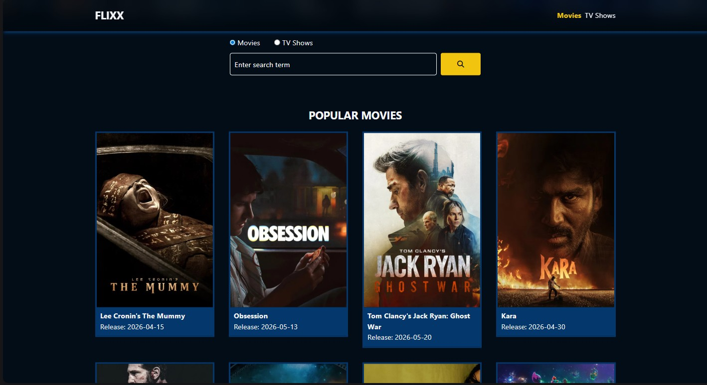

# 🎬 Flixx

A movie and TV show discovery app built with **Vanilla JavaScript** and the [TMDB API](https://www.themoviedb.org/). Browse trending films, explore TV shows, search by title, and view detailed info — all without a framework.



---

## Features

- 🔥 Popular movies and TV shows on the homepage
- 🎞️ Now Playing slider powered by [Swiper.js](https://swiperjs.com)
- 🔍 Search movies and TV shows with paginated results
- 📄 Individual detail pages for movies and TV shows
- 🌐 Pulls live data from the TMDB API (v3)

---

## Tech Stack

- HTML5 / CSS3
- Vanilla JavaScript (ES6+)
- [Tailwind CSS v4.3](https://tailwindcss.com) — utility-first styling via CLI
- [TMDB API v3](https://developers.themoviedb.org/3)
- [Swiper.js](https://swiperjs.com) — for the Now Playing carousel
- Font Awesome — icons

---

## Getting Started

### 1. Clone the repository

```bash
git clone https://github.com/massa-ngl/flixx.git
cd flixx
```

### 2. Set up Tailwind CSS v4.3 (CLI)

**Install Tailwind CSS and the CLI:**

```bash
npm install tailwindcss @tailwindcss/cli
```

**Add the Tailwind import to your main CSS file** (`css/style.css` or your equivalent input file):

```css
@import "tailwindcss";
```

**Build your CSS** (scans all HTML/JS files and writes the output):

```bash
npx @tailwindcss/cli -i ./css/style.css -o ./css/output.css --watch
```

> The `--watch` flag rebuilds automatically as you edit files during development.

**Link the compiled stylesheet in your HTML `<head>`:**

```html
<link href="./css/output.css" rel="stylesheet">
```

> For a one-time production build (no watch), drop the `--watch` flag:
> ```bash
> npx @tailwindcss/cli -i ./css/style.css -o ./css/output.css
> ```

### 3. Get a TMDB API key

Register for a free API key at [https://www.themoviedb.org/settings/api](https://www.themoviedb.org/settings/api).

### 4. Add your API key

Open `js/script.js` and set your key in the global state object near the top of the file:

```js
const global = {
  api: {
    apiKey: 'YOUR_API_KEY_HERE',
    apiUrl: 'https://api.themoviedb.org/3/',
  },
  // ...
};
```

### 5. Run the app

Open `index.html` in your browser directly, or use a local server (recommended):

```bash
# With VS Code Live Server, or:
npx serve .
```
---

## Notes

- **API Key Security:** This project stores the API key client-side for simplicity. For a production deployment, route API calls through a backend proxy to keep your key private.
- The app uses TMDB API **version 3**. Make sure your key is approved for v3 access.
- **Tailwind v4 — no config file needed:** Unlike v3, Tailwind v4 requires no `tailwind.config.js`. The single `@import "tailwindcss"` in your CSS file is all you need to get started.
- Add `node_modules/` and `css/output.css` to your `.gitignore` to avoid committing generated files.

---

## Credits

- Movie/TV data provided by [The Movie Database (TMDB)](https://www.themoviedb.org/)
- Project inspired by Brad Traversy's *Modern JavaScript From The Beginning 2.0* course

---